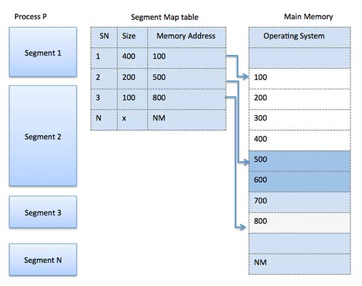

## OS related notes
### Process and threads
Thread is similar to process, thus also called light weight process. However, thread share some resource such as open files and signal, data segment.

Why we need multi-thread programming ? Because it can improve efficiency of program through parallel. Threads operate faster than process because : 
1. Thread creation is much faster.
2. Context switching between threads is much faster.
3. Threads can be terminated easily.
4. Communication between threads is faster.

```cpp
void *myThreadFun(void *vargp) 
{ 
    sleep(1); 
    printf("Printing GeeksQuiz from Thread \n"); 
    return NULL; 
} 
   
int main() 
{ 
    pthread_t thread_id; 
    printf("Before Thread\n"); 
    pthread_create(&thread_id, NULL, myThreadFun, NULL); 
    pthread_join(thread_id, NULL); 
    printf("After Thread\n"); 
    exit(0); 
}
```
 
### Critical Section
Piece of codes that need to be executed atomically, shcu as accessing recourse. A simple solution is as follow : 
```cpp
acquireLock();
process critical section;
releaseLock();
```

Check the codes below : 
```cpp
pthread_t tid[2]; 
int counter; 
  
void* trythis(void *arg) 
{ 
    unsigned long i = 0; 
    counter += 1; 
    printf("\n Job %d has started\n", counter); 
  
    for(i=0; i<(0xFFFFFFFF);i++); 
    printf("\n Job %d has finished\n", counter); 
  
    return NULL; 
} 
  
int main(void) 
{ 
    int i = 0; 
    int error; 
  
    while(i < 2) 
    { 
        error = pthread_create(&(tid[i]), NULL, &trythis, NULL); 
        if (error != 0) 
            printf("\nThread can't be created : [%s]", strerror(error)); 
        i++; 
    } 
  
    pthread_join(tid[0], NULL); 
    pthread_join(tid[1], NULL); 
  
    return 0; 
} 
```

The result might be : 
```command
Job 1 has started
Job 2 has started
Job 2 has finished
Job 2 has finished
```

**Why this happen ?**
Before thread 1 finish, thread 2 might be scheduled, and context switch happen. Thus before thread 1 finish, thread 2 start and modify the global value, thus thread 1 finish with the value set to 2.

**Mutex**

To solve this problem, we can use **Mutex**. It is a lock for critical region, in this case is the `trythis()`.
1. Mutex is a lock that we set before we use shared resource and release after using it.
2. When the lock is set, no other thread can access the lock region. Context switch still happen, but no threads can execute except for the thread has the lock.

Following codes use mutex lock : 
```cpp
pthread_t tid[2]; 
int counter; 
pthread_mutex_t lock; 
  
void* trythis(void *arg) 
{ 
    pthread_mutex_lock(&lock); 
  
    unsigned long i = 0; 
    counter += 1; 
    printf("\n Job %d has started\n", counter); 
  
    for(i=0; i<(0xFFFFFFFF);i++); 
  
    printf("\n Job %d has finished\n", counter); 
  
    pthread_mutex_unlock(&lock); 
  
    return NULL; 
} 
  
int main(void) 
{ 
    int i = 0; 
    int error; 
  
    if (pthread_mutex_init(&lock, NULL) != 0) 
    { 
        printf("\n mutex init has failed\n"); 
        return 1; 
    } 
  
    while(i < 2) 
    { 
        error = pthread_create(&(tid[i]), NULL, &trythis, NULL); 
        if (error != 0) 
            printf("\nThread can't be created :[%s]", strerror(error)); 
        i++; 
    } 
  
    pthread_join(tid[0], NULL); 
    pthread_join(tid[1], NULL); 
    pthread_mutex_destroy(&lock); 

    return 0;
}
```

**Semaphore**
It is a variable. There two kinds of semaphore : 
1. Binary semaphore : 
    It is like mutex. When it is zero, wait. When it is one, operate the critical section.
2. Counter semaphore : 
    There might me multiple units of one resource, thus semaphore can be more than one. Consider following codes : 
    ```cpp
    P(Semaphore s) 
    { 
        s = s - 1; 
        if (s < 0) { 
            // add process to queue 
            block(); 
        } 
    } 
  
    V(Semaphore s) 
    { 
        s = s + 1; 
        if (s >= 0) { 
            // remove process p from queue 
            wakeup(p); 
        } 
    } 
    ```
    When there are no available resource, the process is put into a queue by calling `block()`, wait for the semaphore. Once there are semaphores, the process is resumed by calling `wakeup()`.
    This implementation is more efficient than using a while loop to check.

**The difference between mutex and semaphore**
**Mutex** is a lock mechanism, while semaphore is a signal mechanism. Mutex itself is a lock, it can only owned by a single process or thread at the same time. Also, only the owner can release the lock, this is used to assure atomic operation.

**Semaphore** is a different concept, although the implementation of binary semaphore is similar to mutex. Semaphore can be multiple, thus once there is a room for it, the waiting process can join. 

### Memory Management
**Process Address Space** <br />
The process address space is the set of logical addresses that a process references in its code.
1. Symbolic address
    The addresses used in a source code. The variable names, constants, and instruction labels are the basic elements of the symbolic address space.
2. Relative address
    At the time of compilation, a compiler converts symbolic addresses into relative addresses.
3. Physical address
    The loader generates these addresses at the time when a program is loaded into main memory.

**Static & Dynamic Loading** <br />
1. Static loading : 
    If we have to load your program statically, then at the time of compilation, the complete programs will be compiled and linked without leaving any external program or module dependency.
2. Dynamic loading : 
    If we are using dynamic loading, dynamic routines of the library are stored on a disk in relocatable form and are loaded into memory only when they are needed by the program.

**Swapping** <br />
Swapping is a mechanism in which a process can be swapped temporarily out of main memory (or move) to secondary storage (disk) and make that memory available to other processes.
<br />


**Fragmentation** <br />
As precesses are loaded and removed from memory, the free memory space are broken into pieces. These pieces are not continuous thus the left space might be enough, but no continuous space can be fitted for a new progress.
1. External fragmentation : 
    Total memory space is enough to satisfy a request or to reside a process in it, but it is not contiguous, so it cannot be used.
2. Internal fragmentation : 
    Memory block assigned to process is bigger. Some portion of memory is left unused, as it cannot be used by another process.


External fragmentation can be solved by memory compaction or shuffle memory contents to place all free memory together in one large block.
<br />

**Paging** <br />
Paging is a memory management technique in which process address space is broken into blocks of the same size called pages. The size of the process is measured in the number of pages. <br />
Similarly, main memory is divided into small fixed-sized blocks of (physical) memory called frames and the size of a frame is kept the same as that of a page to have optimum utilization of the main memory and to avoid external fragmentation. <br />


**Address Translation** <br />
1. Page address is called logical address. 
    `Logical Address = Page number + page offset`
2. Frame address is calledphysical address. 
    `Physical Address = Frame number + page offset`

**Advantages and Disadvantages of Paging** <br />
1. Paging reduces external fragmentation, but still suffer from internal fragmentation.
2. Page table requires extra memory space, so may not be good for a system having small RAM.

**Segmentation** <br />
Segmentation is a memory management technique in which each job is divided into several segments of different sizes, one for each module that contains pieces that perform related functions. Each segment is actually a different logical address space of the program.
<br />
Segmentation memory management works very similar to paging but here segments are of variable-length where as in paging pages are of fixed size.
<br />



### Reference
1. [Memory Management](https://www.tutorialspoint.com/operating_system/os_memory_management.htm)

